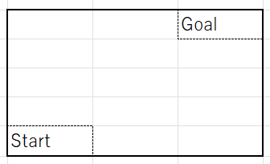
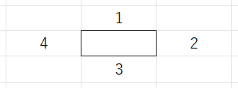

# 研究内容
## ザックリとした説明
- 混雑を避ける(リアルタイム)
- 人気の観光地にもちゃんと行く
この2つを満たすような観光ルートの作成

## 研究の計画
1. 混雑を加味せず、最適なルートを作成できるようになる。
2. 人気の観光地を含んだルートを生成できるようになる。
3. 混雑を加味したルートを生成できるようになる。

# マス目のGA

## この課題を選んだ理由
### 巡回セールスマン問題とマス目の比較
- 巡回セールスマン問題的なルート作成。
  - 特定のノードからどこのノードにも行くことができる。
  - 車のような移動手段
- マス目問題的なルート作成。
  - 特定のノードから特定のノードにしか行けない。
  - 電車のルート作成
  
## 2通りのアルゴリズムを作成
### 進む方向を管理

進んだ方向を配列で管理する。

### 進んだマスを管理
マスに番号をつけて、管理する。

## 問題点
### 交叉が難しい
- 前のノードによって、次のノードの内容が制限されるので、交叉が難しい。

## 聞きたいこと
- 交叉が進むと同じ子供が大量にできてしまうのは、自然なことなのか
- 評価関数は、Goalにたどり着かないときも評価をしているがこれは正しいのか
- 交叉の方法 (似たように前のノードによって、次のノードが制限されるようなアルゴリズムはあるのか)
- ウイルス混入の方法
- モデルの落とし込み方はまずいのか
- モデルの落とし込み方
- 自由にノードを選択する方法もなしではないので、そっちにすべきかどうか